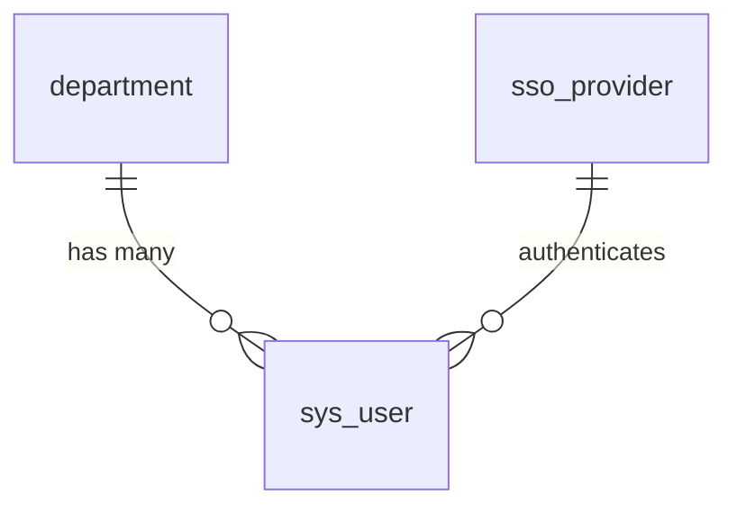

# User Management System

The User Management system handles all aspects of user data, authentication, and organizational structure within PulsePlus.

## Core Tables

### Department Table

The `department` table manages organizational divisions within the system.

```sql
CREATE TABLE department (
    sys_id UUID PRIMARY KEY,
    name VARCHAR(255) UNIQUE,
    description TEXT
);
```

#### Key Features:
- Unique department names
- Optional description field
- UUID-based identification

### System User Table

The `sys_user` table is the core user entity table, storing all user-related information.

```sql
CREATE TABLE sys_user (
    sys_id UUID PRIMARY KEY,
    user_name VARCHAR(40) UNIQUE,
    first_name VARCHAR(40),
    last_name VARCHAR(40),
    email VARCHAR(100) UNIQUE,
    role user_role,
    password_hash VARCHAR(255),
    active BOOLEAN,
    locked_out BOOLEAN,
    last_login TIMESTAMPTZ,
    department_id UUID REFERENCES department(sys_id),
    avatar_url VARCHAR(255),
    about_me TEXT,
    sys_created_at TIMESTAMPTZ,
    sys_updated_at TIMESTAMPTZ
);
```

#### Key Features:
- Secure password storage with hashing
- Role-based access control
- Account status tracking
- Department association
- Profile customization

### SSO Provider Table

The `sso_provider` table manages Single Sign-On integration configurations.

```sql
CREATE TABLE sso_provider (
    sys_id UUID PRIMARY KEY,
    name VARCHAR(255),
    entity_id VARCHAR(255),
    login_url VARCHAR(255),
    logout_url VARCHAR(255),
    certificate TEXT,
    active BOOLEAN
);
```

#### Key Features:
- Multiple SSO provider support
- Provider activation control
- Secure certificate storage

## Relationships



## Common Queries

### User Authentication
```sql
SELECT sys_id, user_name, password_hash, active, locked_out
FROM sys_user
WHERE user_name = $1 AND active = true AND locked_out = false;
```

### Department Members
```sql
SELECT u.first_name, u.last_name, u.email
FROM sys_user u
JOIN department d ON u.department_id = d.sys_id
WHERE d.name = $1;
```

### Active SSO Providers
```sql
SELECT name, login_url
FROM sso_provider
WHERE active = true;
```

## Best Practices

1. **Password Security**
   - Always use password hashing
   - Never store plain-text passwords
   - Implement password complexity requirements

2. **User Roles**
   - Use the `user_role` enum type
   - Implement role-based access control
   - Regular role audit recommendations

3. **Department Management**
   - Maintain unique department names
   - Consider department hierarchies
   - Regular department structure review

4. **SSO Configuration**
   - Regular certificate rotation
   - Monitor SSO provider status
   - Implement fallback authentication

## Maintenance Tasks

1. **Regular Cleanup**
   ```sql
   -- Update last login for inactive users
   UPDATE sys_user
   SET active = false
   WHERE last_login < NOW() - INTERVAL '90 days';
   ```

2. **Department Audit**
   ```sql
   -- Find departments with no users
   SELECT d.name
   FROM department d
   LEFT JOIN sys_user u ON d.sys_id = u.department_id
   WHERE u.sys_id IS NULL;
   ```

3. **SSO Health Check**
   ```sql
   -- Check SSO provider status
   SELECT name, active
   FROM sso_provider
   WHERE active = true
   AND last_health_check < NOW() - INTERVAL '1 day';
   ``` 