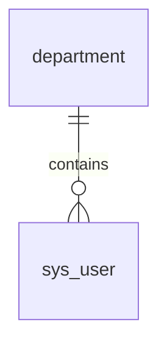

import { Tabs, Tab } from 'nextra/components';

# User Management Schema

<Tabs items={['SQL', 'Diagram', 'Relationships']}>
  <Tab>
```sql
CREATE TABLE department (
    sys_id UUID PRIMARY KEY,
    name VARCHAR(255) UNIQUE
);
```
  </Tab>
  
  <Tab>

  </Tab>

  <Tab>
```json
{
  "department": ["sys_user"],
  "sso_provider": ["sys_user"]
}
```
  </Tab>
</Tabs> 