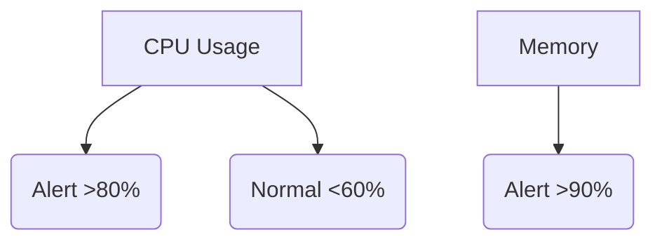

# System Monitoring

## Key Metrics

```mermaid
graph TD
  A[CPU Usage] --> B(Alert >80%)
  A --> C(Normal <60%)
  D[Memory] --> E(Alert >90%)
```

## Dashboard Setup
```bash
# Install monitoring stack
helm install monitoring prometheus-community/kube-prometheus-stack
```
