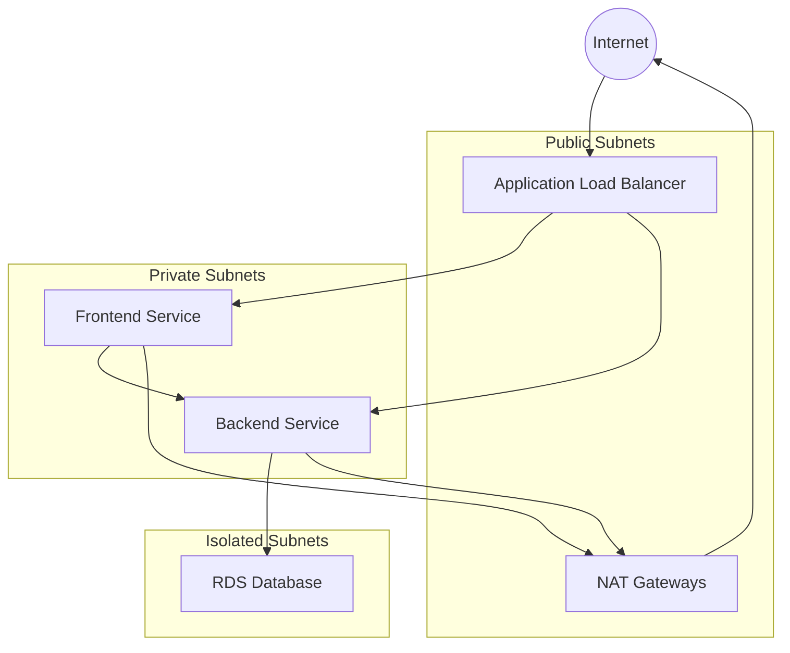
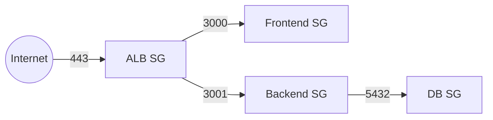

# Infrastructure Standards

## Overview

PulsePlus uses AWS CDK for Infrastructure as Code (IaC), implementing a production-grade architecture with high availability, security, and scalability.

## Architecture Components

### VPC and Networking



#### Configuration
- Multi-AZ deployment (2 AZs)
- Subnet tiers:
  - Public: ALB and NAT Gateways
  - Private: Application services
  - Isolated: Database
- NAT Gateways for outbound traffic

### Compute Layer

#### Frontend Service (Next.js)
- Platform: ECS Fargate
- Resources:
  - Memory: 1024 MiB
  - CPU: 512 units
- Auto-scaling:
  - Min: 2 tasks
  - Max: 10 tasks
  - Scale on 70% CPU utilization
- Health checks:
  - Path: /
  - Codes: 200, 304
  - Interval: 30 seconds

#### Backend Service (API)
- Platform: ECS Fargate
- Resources:
  - Memory: 1024 MiB
  - CPU: 512 units
- Auto-scaling:
  - Min: 2 tasks
  - Max: 10 tasks
  - Scale on 70% CPU utilization
- Health checks:
  - Path: /api/health
  - Codes: 200
  - Interval: 30 seconds

### Database Layer

#### RDS PostgreSQL
- Instance: t3.small
- Version: PostgreSQL 13
- Storage: Encrypted at rest
- Backup:
  - Retention: 7 days
  - Automated backups enabled
- Network: Isolated subnet
- Security:
  - Encrypted connections
  - Private subnet access only

### Security Components

#### WAF Configuration
- Rate limiting: 2000 requests per IP
- Customizable rule sets
- Regional scope
- CloudWatch metrics enabled

#### SSL/TLS
- ACM-managed certificates
- DNS validation
- Automatic HTTPS redirection
- Modern TLS protocols

#### Security Groups


### Monitoring and Observability

#### CloudWatch Alarms
- CPU Utilization (90% threshold)
- HTTP 5xx errors (10 errors threshold)
- Container insights enabled
- Custom metrics available

#### Logging
- Application logs
- Access logs
- Container insights
- Audit trails

## Infrastructure Standards

### Naming Conventions

```typescript
// Resource naming pattern
const resourceName = `${props.environment}-${props.appName}-${resourceType}`;

// Example
const dbName = `prod-pulseplus-postgres`;
```

### Tagging Strategy

Required tags for all resources:
- Environment
- Application
- Owner
- CostCenter
- SecurityLevel

### Security Standards

1. **Network Security**
   - No direct internet access for private resources
   - Security group principle of least privilege
   - WAF protection for public endpoints

2. **Data Security**
   - Encryption at rest for all data stores
   - Encryption in transit for all communications
   - Secrets management for sensitive data

3. **Access Control**
   - IAM roles for service access
   - Security group isolation
   - Private subnet isolation

### Cost Optimization

1. **Resource Sizing**
   ```typescript
   // Example of environment-based sizing
   const instanceType = props.environment === 'production'
     ? ec2.InstanceType.of(ec2.InstanceClass.T3, ec2.InstanceSize.SMALL)
     : ec2.InstanceType.of(ec2.InstanceClass.T3, ec2.InstanceSize.MICRO);
   ```

2. **Auto-scaling Configuration**
   ```typescript
   // Production scaling
   const prodScaling = {
     minCapacity: 2,
     maxCapacity: 10,
     targetCpuUtilization: 70
   };

   // Non-production scaling
   const nonProdScaling = {
     minCapacity: 1,
     maxCapacity: 3,
     targetCpuUtilization: 80
   };
   ```

## Deployment Guidelines

### Pre-deployment Checklist

1. Domain Configuration
   - Route53 hosted zone exists
   - SSL certificate validation ready

2. Network Prerequisites
   - VPC CIDR planning
   - Subnet allocation strategy
   - NAT Gateway requirements

3. Security Setup
   - WAF rules configured
   - Security groups defined
   - SSL certificates prepared

### Deployment Process

1. **Infrastructure Deployment**
   ```bash
   # Bootstrap CDK (first time only)
   cdk bootstrap

   # Deploy with environment parameters
   cdk deploy --parameters domainName=your-domain.com \
              --parameters environment=production
   ```

2. **Application Deployment**
   ```bash
   # Build and push frontend
   docker build -t pulseplus-frontend ./frontend
   docker tag pulseplus-frontend:latest <frontend-repo-uri>:latest
   docker push <frontend-repo-uri>:latest

   # Build and push backend
   docker build -t pulseplus-backend ./backend
   docker tag pulseplus-backend:latest <backend-repo-uri>:latest
   docker push <backend-repo-uri>:latest
   ```

### Post-deployment Verification

1. **Health Checks**
   - Frontend service health
   - Backend service health
   - Database connectivity
   - SSL certificate validation

2. **Security Verification**
   - WAF rules active
   - Security groups effective
   - HTTPS redirection working

3. **Monitoring Setup**
   - CloudWatch alarms active
   - Logging configured
   - Metrics collecting

## Maintenance Standards

### Backup Strategy

1. **Database Backups**
   - Daily automated backups
   - 7-day retention period
   - Point-in-time recovery enabled

2. **Configuration Backups**
   - Infrastructure code version controlled
   - Secrets backed up in AWS Secrets Manager
   - Configuration values documented

### Update Process

1. **Infrastructure Updates**
   - Review changes in staging
   - Apply during maintenance window
   - Follow change management process

2. **Security Updates**
   - Regular security group review
   - WAF rule updates
   - SSL certificate rotation

### Monitoring and Alerts

1. **Performance Monitoring**
   - CPU utilization
   - Memory usage
   - Network throughput
   - Response times

2. **Security Monitoring**
   - WAF blocks
   - Failed access attempts
   - Security group violations

## Disaster Recovery

### Backup and Restore

1. **Database Recovery**
   - Point-in-time recovery
   - Cross-region backup copies
   - Regular restore testing

2. **Application Recovery**
   - Container image versioning
   - Configuration backups
   - Infrastructure code versioning

### Failover Procedures

1. **Database Failover**
   - RDS automated failover
   - Manual failover process
   - Data consistency verification

2. **Application Failover**
   - Load balancer health checks
   - Auto-scaling group recovery
   - DNS failover configuration 